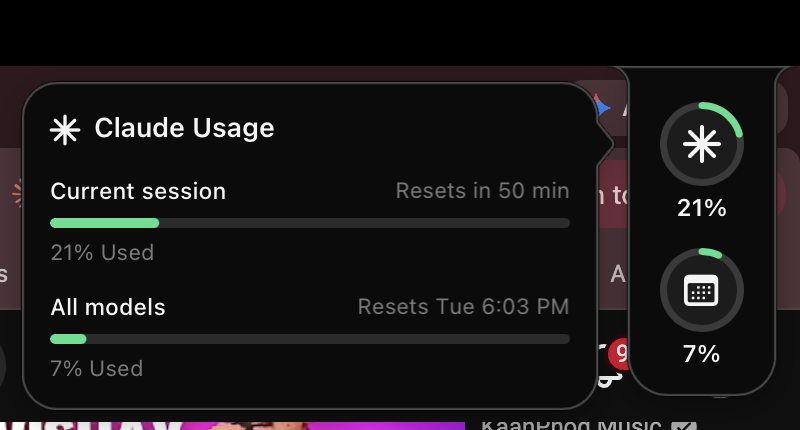
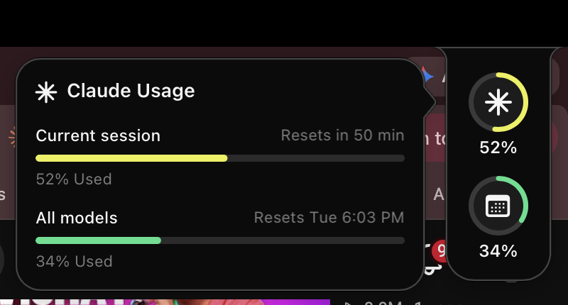
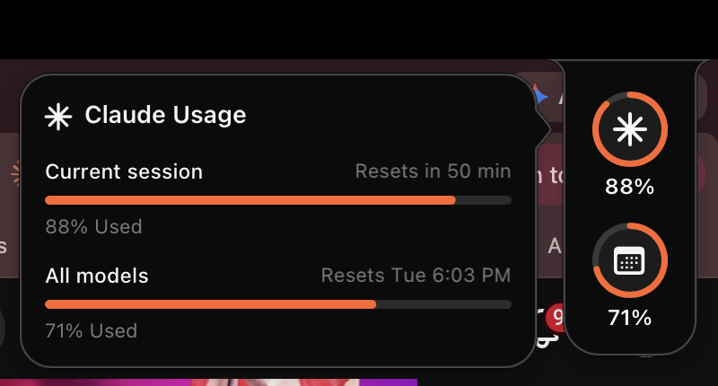

# 🎨 ClaudeBar — Live Claude Usage in Your Menu Bar


A small black tab that hangs off the corner of your menu bar, showing one ring
per Claude rate limit — your current session, your weekly all-models window, and
whatever else your account is subject to. Green while you have room, yellow
around half, red-orange once it's tight. **Hover the tab** and a panel slides out
with the full picture: what each limit is, when it resets, and how much is gone.

The tab belongs to the menu bar, so it leaves with it — go full screen and it
gets out of the way on its own.

## 😩 Why

Checking your Claude usage means: open claude.ai → profile → usage. Or run
`/usage` inside Claude Code. Every. Single. Time. ClaudeBar turns that into a
glance at the corner of your menu bar.

```
 ┌── menu bar ──────────────────────────────────┬────┐
 │  🔇  📶  🔍  ⚙︎      Thu 27 Aug 11.22        │    │
 └──────────────────────────────────────────────┤ ╭╮ │  ← rings, one per limit
   ╭──────────────────────────╮                 │ ╰╯ │
   │ ✳ Claude Usage           │                 │73% │
   │ Current session   51 min │◀── hover to     │    │
   │ ▓▓▓▓▓▓▓▓▓▓▓░░░░░░░░░░░░  │    open the     │ ╭╮ │
   │ 73% Used                 │    panel        │ ╰╯ │
   │ All models    Thu 12 AM  │                 │ 7% │
   │ ▓░░░░░░░░░░░░░░░░░░░░░░  │                 │    │
   │ 7% Used                  │                 └────┘
   ╰──────────────────────────╯
```

## 📸 See it

| Fresh | Halfway | Almost out |
|:---:|:---:|:---:|
|  |  |  |

## 🚦 What the colors mean

| Usage | Ring and bar color |
|-------|-----------------------------|
| 0–40% | 🟢 Green `#3ADE79` |
| 41–70% | 🟡 Yellow `#E8F03B` |
| 71–100% | 🔴 Red-orange `#FF4B22` |
| fetch failing | dimmed, panel reads "Updates paused" |
| no data yet | a dash in the tab |

## 🖱️ Using it

| Action | What happens |
|--------|--------------|
| Hover the tab | The panel opens beside it |
| Move away | The panel closes |
| Right-click the tab | Refresh now, or quit |
| Go full screen | The tab hides with the menu bar and comes back with it |

## 📦 Install

```bash
git clone git@github.com:arukurmi/LiveClaudeUsage.git
cd LiveClaudeUsage
make install
```

That's it — the tab appears immediately and starts automatically at every login.

> 🔑 **First run:** macOS may ask permission for `claudebar` to read the
> `Claude Code-credentials` Keychain item. Click **Always Allow**.

Requires macOS 13+ and Xcode Command Line Tools (`xcode-select --install`).
You must be logged into [Claude Code](https://claude.com/claude-code) at least once.

## ⚙️ Configuration

Everything is configurable via `~/.config/claudebar/config.json` (see
[`examples/config.json`](examples/config.json)). Missing keys keep their
defaults; invalid values fall back safely.

```json
{
  "side": "right",
  "pollIntervalSeconds": 120,
  "thresholds": [
    { "upTo": 40,  "color": "#3ADE79" },
    { "upTo": 70,  "color": "#E8F03B" },
    { "upTo": 100, "color": "#FF4B22" }
  ]
}
```

| Key | What it does | Default |
|-----|--------------|---------|
| `side` | Which top corner the tab hangs from: `"left"` or `"right"` | `"right"` |
| `pollIntervalSeconds` | How often to fetch usage (min 5) | `120` |
| `thresholds` | Your own colors 🎨, any number of tiers | see above |

Configs written for the old edge bar still load — `widthPx`, `showEmoji`,
`showResetTime` and per-threshold `emoji` describe UI that no longer exists, so
they are ignored rather than rejected.

After editing the config, restart it:
`launchctl kickstart -k gui/$(id -u)/com.arukurmi.claudebar`

The tab always appears on the **built-in MacBook display**, even with external
monitors connected.

## 🔍 How it works

1. 🔐 Reads your Claude Code OAuth token from the macOS Keychain — the same
   credential the `claude` CLI already uses. Nothing new to log into.
2. 🌐 Every 2 minutes, calls Anthropic's OAuth usage endpoint
   (`api.anthropic.com/api/oauth/usage`) and reads its `limits` array — the
   server names each window, so a limit Anthropic adds later just shows up as
   another ring. (Undocumented endpoint — the same data `/usage` shows.)
3. 🖥️ Renders it as CoreAnimation layers in two borderless, non-activating
   `NSPanel`s at status-bar level, visible on every Space.

Native Swift + AppKit. One ~200KB binary. Zero dependencies. Near-zero CPU.

### ⏱️ Polling that can't silently die

- Every request has a hard timeout (15s request, 30s overall) — a hung
  connection can never freeze the poll loop. The keychain lookup is bounded
  too, so a locked-keychain prompt can't stall it either.
- A watchdog restarts polling if a tick is ever missed, whatever the cause.
- Failures (offline, rate limits) back off exponentially up to 10 minutes,
  showing the last known values dimmed instead of hiding the tab.
- Rate limits are respected properly: a `429`/`529` with a `Retry-After`
  header waits at least that long, and every backoff carries ±25% jitter so
  many clients don't retry in lockstep.
- On wake from sleep, screen wake, or session unlock the backoff resets and
  the rings refresh within seconds.
- The app opts out of App Nap (while still allowing system sleep), so ticks
  fire at the configured interval, not whenever macOS feels like it.

## 🛠️ CLI flags

| Flag | What it does |
|------|--------------|
| `claudebar --once` | Print every limit to stdout and exit |
| `claudebar --demo` | Animate 0→100→0 forever (no network) — try `make demo` |
| `claudebar --fixed 73,7 [--open]` | Render fixed percentages, optionally with the panel pinned open (for screenshots) |

## 🧪 Development

```bash
make build     # release build
make test      # run the test suite (plain executable — CLT has no XCTest)
make demo      # watch the full color sweep
```

## 🗑️ Uninstall

```bash
make uninstall
```

## 📄 License

[MIT](LICENSE) © 2026 Aryansh Kurmi
